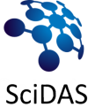

](https://gemmaker.readthedocs.io/en/latest/)

**For Complete Instructions on useage, visit: [GEMmaker documentation](https://gemmaker.readthedocs.io/en/latest/)**

GEMmaker is a [Nextflow](https://www.nextflow.io/) workflow for large-scale gene expression sample processing, expression-level quantification and Gene Expression Matrix (GEM) construction. Results from GEMmaker are useful for differential gene expression (DGE) and gene co-expression network (GCN) analyses. The GEMmaker workflow currently supports Illumina RNA-seq datasets.

## GEMmaker is:

### Easy to Use

- No bioinformatics software installation required
- Runs on a stand-alone computer or High Performance Compute (HPC) cluster
- Simple configuration file setup
- Resulting data is ready for Differential Gene Expression (DGE) or Gene Co-Expression Network (GCN) analysis
- Full online documentation

### Reproducible

- Software versions and computing environment are the same every time an experiment is repeated
- Sharing input data and config files ensures anyone can reproduce exact results

### Interoperable  

- Uses a variety of bioinformatics tools
- Integrates with iRODs for easy data movement
- Easily retrieves samples from NCBI’s Sequence Read Archive (SRA)
- Can combine local samples with those from SRA
- Runs on many modern HPC systems

### Discoverable

- Sample metadata is retrieved from NCBI SRA
- Controlled vocabularies are used to automatically remap SRA annotations
- JSON-format metadata files are created for each sample
- Metadata files can be integrated with data in iRODs for querying

### Scalable

- Useful for small DGE projects with 100s of samples as well as large GCN projects with 1000s of samples
- Cleans up intermediate files once they are no longer needed
- Keeps storage requirements to a minimum

## Tools

GEMmaker uses the following tools:

- [python3](https://www.python.org) v3.5.1
- [nextflow](https://www.nextflow.io/) v0.32
- [sratoolkit](https://www.ncbi.nlm.nih.gov/books/NBK158900/) v2.9.2
- [aspera](https://asperasoft.com/) v3.8.1
- [fastQC](https://www.bioinformatics.babraham.ac.uk/projects/fastqc/) v0.11.7
- [trimmomatic](http://www.usadellab.org/cms/?page=trimmomatic) v0.38
- [hisat2](https://ccb.jhu.edu/software/hisat2/index.shtml) v2.1.0
- [kallisto](https://pachterlab.github.io/kallisto/) v0.45.0
- [salmon](https://combine-lab.github.io/salmon/) v0.12.0
- [samtools](http://www.htslib.org/) v1.3.1
- [stringTie](http://www.ccb.jhu.edu/software/stringtie/) v1.3.4d
- [MultiQC](http://multiqc.info/) v1.5

## Usage

For Complete Instructions on useage, visit: [GEMmaker documentation](https://gemmaker.readthedocs.io/en/latest/)

## Acknowledgments

GEMmaker is a collaborative project of the [Ficklin](http://ficklinlab.cahnrs.wsu.edu/) and [Feltus](https://www.clemson.edu/science/departments/genetics-biochemistry/people/profiles/ffeltus) programs at [Washington State University](http://www.wsu.edu) and [Clemson University](http://www.clemson.edu) respectively with guidance from [RENCI](https://renci.org/).

GEMmaker is funded by the [NSF SciDAS](http://scidas.org/) project, [award #1659300](https://www.nsf.gov/awardsearch/showAward?AWD_ID=1659300)

&nbsp;&nbsp;
&nbsp;&nbsp;
&nbsp;&nbsp;
&nbsp;&nbsp;

